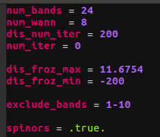

# Wannier90 for Vim

This is vim syntax for Wannier90.
If you write a Wannier90-input, this syntax help you.


I made this with reference to quantum_espresso-vim.  
Please check quantum_espresso-vim(https://github.com/leseixas/quantum_espresso-vim).

## Install
If there are not syntax and ftdetect directory under ./.vim/, please make them.  
```
cp ./wannier.vim          ~/.vim/syntax/wannier.vim
cp ./wannier-detect.vim   ~/.vim/ftdetect/wannier-detect.vim
```

## About param2vim.py
You may not use this script. So, the details are omitted.<br>
<br>
To use param2vim.py, you must have
+ quantum_espresso-vim(https://github.com/leseixas/quantum_espresso-vim/syntax/espresso.vim)
+ Wannier90-Userguide($wannier90/doc/parameters.tex) 

<p>
With using these file, wannier.vim can be made.
The created wannier.vim include only namelist, so it is not completed.
</p>
